<!--
  ============================================================
  README upgrade notes (safe to delete before publishing):
  - Palette preserved exactly: #F7CAD0 (pink) · #C9A7EB (lavender) · #E8D5F2 (light lavender) · #FFF9FB (bg)
  - Banner, layout order, and animation style are unchanged.
  - Anchor links in "Quick Navigation" point to the section headers below —
    GitHub auto-generates these anchors from heading text, so don't rename
    headings without updating the links.
  - The Contribution Snake needs a one-time GitHub Actions workflow to
    generate the animated SVG. Instructions + the workflow file are in the
    "GitHub Activity" section comment below — it won't render until that
    workflow runs once.
  - All repo/demo/docs links use TODO placeholders where I don't have your
    actual repo names — swap in real URLs when ready.
  ============================================================
-->

  

 

 

<!-- Quick nav: plain markdown links to heading anchors, so no extra tooling needed -->

[About](#about-me) · [Projects](#featured-projects) · [Tech Stack](#tech-stack) · [GitHub Stats](#github-activity) · [Contact](#lets-connect)

 

 

## About Me

Electronics & Computer Engineering student passionate about Full-Stack Development, AI/ML, Cloud Computing, and modern software engineering. I enjoy building practical applications that solve real-world problems, from AI-powered web platforms to cloud-native solutions. Every project is an opportunity to strengthen my problem-solving skills and create software that's useful, scalable, and user-focused.

 

## Featured Projects

<table>
<tr>
<td width="50%" valign="top">

### 🧠 AI Study Companion
**MERN Stack + AI**

An intelligent study assistant that helps students organize learning material and get AI-generated explanations and summaries in real time.

`React` `Node.js` `Express` `MongoDB` `AI Integration`

</td>
<td width="50%" valign="top">

### 📧 Smart Email Classifier
**Firebase + AI**

An ML-powered classifier that automatically sorts and prioritizes incoming emails, built on a serverless Firebase backend.

`Firebase` `Python` `Machine Learning` `Cloud Functions`

</td>
</tr>
<tr>
<td width="50%" valign="top">

### 🍦 Ice Cream Ordering Web App
**Full-Stack Development**

A complete ordering platform with flavor selection, order management, database integration, and receipt generation.

`HTML` `CSS` `JavaScript` `Node.js` `Express.js` `PostgreSQL`

</td>
<td width="50%" valign="top">

### 🤖 MATLAB + Robotics Projects
**Signal Processing & Automation**

A collection of robotics and control-systems projects exploring simulation, signal processing, and automation using MATLAB.

`MATLAB` `Robotics` `Signal Processing`

</td>
</tr>
<tr>
<td width="50%" valign="top">

### 🤟 Text/Voice to Sign Language Translator
**NLP + 3D Avatars**

Converts text and speech into Indian Sign Language gestures using NLP and a 3D avatar, with fingerspelling support for unknown words.

`NLP` `Speech Recognition` `Three.js` `Blender`

</td>
<td width="50%" valign="top">

### 🔐 Federated Learning for Credit Risk
**Privacy-Preserving ML**

A privacy-first credit risk model using Differential Privacy and Explainable AI (SHAP) for a real-world finance use case.

`Python` `Federated Learning` `SHAP`

</td>
</tr>
<tr>
<td width="50%" valign="top">

### 🎵 Emotion-Based Music Recommender
**Computer Vision**

Detects emotions through facial expressions using CNNs and OpenCV, then maps them to personalized music recommendations.

`Python` `OpenCV` `CNN`

</td>
<td width="50%" valign="top">

### 📊 Process Scheduling Simulator
**Operating Systems**

Simulates FCFS, SJF, Priority, and Round Robin scheduling algorithms with interactive Gantt chart visualizations.

`HTML` `CSS` `JavaScript`

</td>
</tr>
</table>
 

## Tech Stack

**Languages**
 

**Web Development**
 

**AI / ML**
 

**Tools & Platforms**
 

 
 

## GitHub Activity

 

  

<!-- Activity graph, same pastel palette as the rest of the profile -->

  

<!--
  Contribution snake: requires a one-time GitHub Actions workflow to
  generate contribution-snake.svg on your account. Steps:
  1. Create .github/workflows/snake.yml in this repo with the content below.
  2. Push it — the action runs on a schedule and on push, and commits the
     generated SVG to an "output" branch.
  3. Once it's run once, this  tag will render automatically.

  ---- .github/workflows/snake.yml ----
  name: Generate Snake
  on:
    schedule:
      - cron: "0 0 * * *"
    workflow_dispatch:
    push:
      branches: [ main ]
  jobs:
    generate:
      runs-on: ubuntu-latest
      steps:
        - uses: Platane/snk@v3
          with:
            github_user_name: nidhichougule
            outputs: |
              dist/snake-pink.svg?palette=github-light
              dist/snake-pink.gif?color_snake=%23C9A7EB&color_dots=%23FFE1EC,%23F6C9DE,%23F7CAD0,%23C9A7EB,%23A47DC0
        - uses: crazy-max/ghaction-github-pages@v4
          with:
            target_branch: output
            build_dir: dist
          env:
            GITHUB_TOKEN: ${{ secrets.GITHUB_TOKEN }}
  --------------------------------------
-->
<picture>
  <source
    media="(prefers-color-scheme: dark)"
    srcset="https://raw.githubusercontent.com/nidhichougule/nidhichougule/output/snake-pink-dark.svg" />
  <source
    media="(prefers-color-scheme: light)"
    srcset="https://raw.githubusercontent.com/nidhichougule/nidhichougule/output/snake-pink.svg" />
  
</picture>

  Just the beginning. Many more shades to come.

 
 
 

## Currently Learning

 

## Coding Profile

 

 
 

## Beyond Code

When I'm away from my keyboard, you'll probably find me sketching portraits, soldering electronics, crocheting, or exploring new creative ideas.

🎨 **Fun fact:** I debug code, sketch portraits, and solder circuits with the same patience.
 
 

## Let's Connect

Whether you're a **recruiter** scanning for your next intern, a **collaborator** with an idea worth building, or part of an **open-source project** looking for an extra pair of hands — I'd genuinely love to hear from you.

I'm currently open to **SDE / Full-Stack / AI Engineer internship** opportunities.

  

